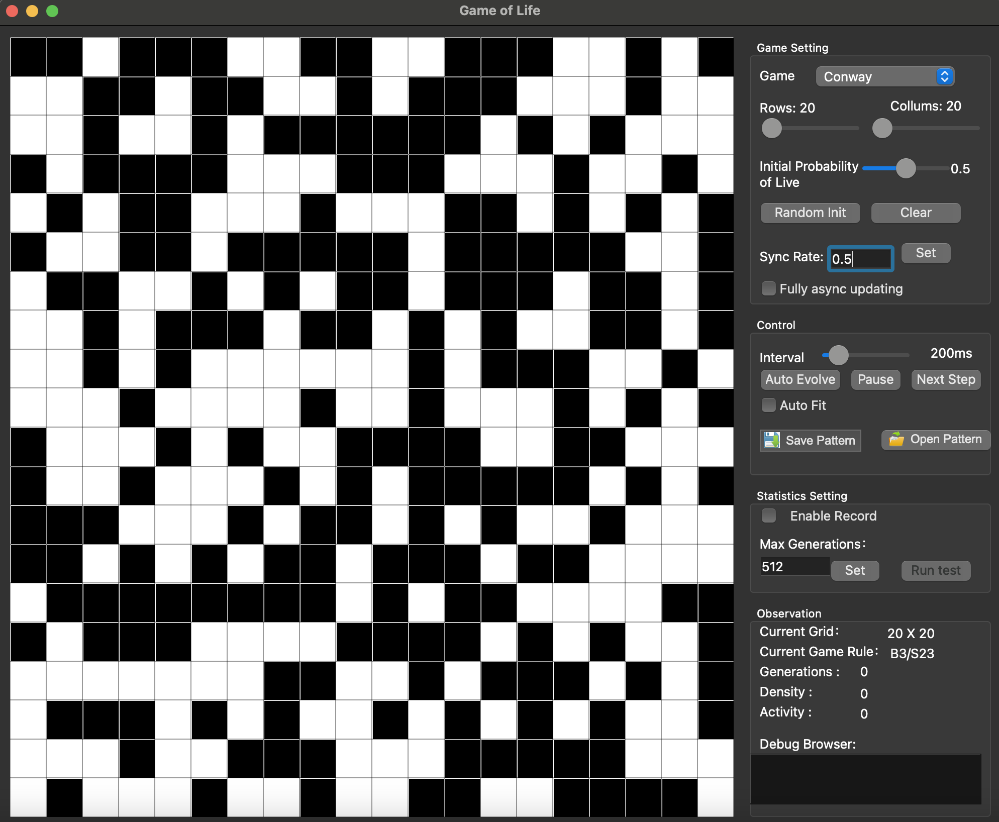

# Introduction
This project implements Conway's Game of Life (Refer to https://en.wikipedia.org/wiki/Conway%27s_Game_of_Life) along with various variants of cellular automaton.

# Features
- Supports custom rules for cell birth and survival
- Automatic boundary expansion
- Support Synchronous rate setting
- Support fully asynchronous updating
- Support RLE files save and reopen.
- Statistics record for game data
